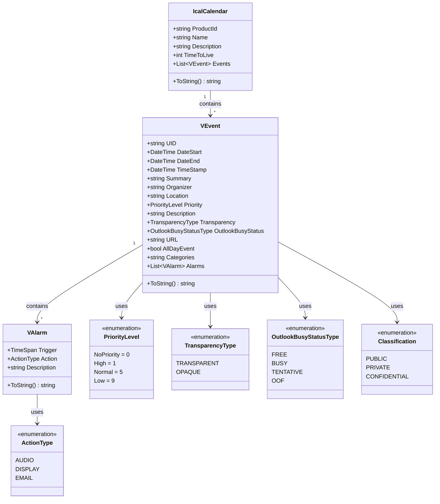
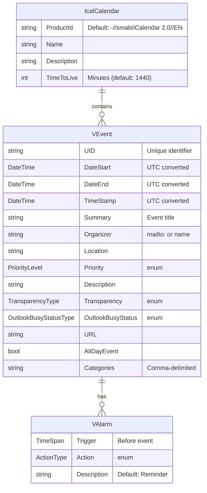

# Smab.Calendar

A .NET library for creating iCalendar (RFC 5545) formatted streams for calendar events.

[](https://www.nuget.org/packages/Smab.Calendar/)
[](https://opensource.org/licenses/MIT)

## Overview

Smab.Calendar is a lightweight .NET 10 library that enables you to create iCalendar (.ics) format files programmatically. It implements a subset of [RFC 5545](https://tools.ietf.org/html/rfc5545) specification and is compatible with popular calendar applications like Microsoft Outlook, Google Calendar, and Apple Calendar.

## Features

- ✅ Create iCalendar (`.ics`) formatted calendar streams
- ✅ Support for multiple events in a single calendar
- ✅ Event alarms/reminders with customizable triggers
- ✅ Priority levels for events
- ✅ Time transparency (busy/free status)
- ✅ Outlook busy status integration
- ✅ All-day events support
- ✅ Event categories
- ✅ Location and organizer information
- ✅ UTC time conversion
- ✅ Custom publication schedule (TTL)

## Installation

```bash
dotnet add package Smab.Calendar
```

Or via NuGet Package Manager:

```powershell
Install-Package Smab.Calendar
```

## Quick Start

```csharp
using Smab.Calendar;

// Create a simple event
var vEvent = new VEvent
{
    UID = "unique-event-id@yourdomain.com",
    Summary = "Team Meeting",
    Description = "Weekly team sync-up meeting",
    Location = "Conference Room A",
    DateStart = DateTime.Now.AddDays(1),
    DateEnd = DateTime.Now.AddDays(1).AddHours(1),
    Organizer = "mailto:manager@company.com"
};

// Add an alarm (reminder) 15 minutes before
vEvent.Alarms.Add(new VAlarm(TimeSpan.FromMinutes(15)));

// Create a calendar and add the event
var calendar = new IcalCalendar
{
    Name = "Work Calendar",
    Description = "My work schedule",
    ProductId = "-//MyCompany//Calendar 1.0//EN"
};
calendar.Events.Add(vEvent);

// Generate iCalendar format string
string icalContent = calendar.ToString();

// Save to file or return as HTTP response
File.WriteAllText("meeting.ics", icalContent);
```

## Entity Model

### Class Diagram



### Entity Relationship Diagram



## Core Classes

### IcalCalendar

The main container class representing an iCalendar object.

**Properties:**
- `ProductId` - Identifies the product that created the calendar (default: "-//smab/iCalendar 2.0//EN")
- `Name` - Calendar name (X-WR-CALNAME)
- `Description` - Calendar description (X-WR-CALDESC)
- `TimeToLive` - Publication schedule in minutes (default: 1440 = 1 day)
- `Events` - List of VEvent objects

**Example:**
```csharp
var calendar = new IcalCalendar
{
    Name = "Personal Calendar",
    Description = "My personal events",
    TimeToLive = 60 // Update every hour
};
```

### VEvent

Represents a calendar event (VEVENT component).

**Key Properties:**
- `UID` - **Required**: Unique identifier for the event
- `DateStart` / `DateEnd` - Event timing (automatically converted to UTC)
- `TimeStamp` - When the event was created (default: DateTime.Now)
- `Summary` - Event title/subject
- `Description` - Detailed event description
- `Location` - Where the event takes place
- `Organizer` - Event organizer (supports mailto: URLs or plain names)
- `Priority` - Event priority (High=1, Normal=5, Low=9)
- `Transparency` - Whether the event blocks time (OPAQUE) or not (TRANSPARENT)
- `AllDayEvent` - Set to true for all-day events
- `Categories` - Comma-delimited categories
- `URL` - Link to more information
- `Alarms` - List of reminder alarms

**Example:**
```csharp
var birthday = new VEvent
{
    UID = "birthday-2024@myapp.com",
    Summary = "Mom's Birthday",
    DateStart = new DateTime(2024, 6, 15, 9, 0, 0),
    DateEnd = new DateTime(2024, 6, 15, 18, 0, 0),
    AllDayEvent = true,
    Priority = VEvent.PriorityLevel.High,
    Categories = "Personal,Birthday",
    Transparency = VEvent.TransparencyType.TRANSPARENT
};
```

### VAlarm

Represents an alarm/reminder for an event.

**Properties:**
- `Trigger` - TimeSpan before the event to trigger the alarm
- `Action` - Type of alarm action (AUDIO, DISPLAY, EMAIL)
- `Description` - Alarm description text

**Example:**
```csharp
// 30-minute reminder
var alarm = new VAlarm(TimeSpan.FromMinutes(30))
{
    Action = VAlarm.ActionType.DISPLAY,
    Description = "Meeting starts soon!"
};
```

## Enumerations

### VEvent.PriorityLevel
```csharp
NoPriority = 0
High = 1
Normal = 5  // Default
Low = 9
```

### VEvent.TransparencyType
```csharp
TRANSPARENT  // Time is free
OPAQUE       // Time is blocked (default)
```

### VEvent.OutlookBusyStatusType
```csharp
FREE
BUSY
TENTATIVE
OOF  // Out of Office
```

Note: `OutlookBusyStatus` is automatically set based on `Transparency` property.

### VEvent.Classification
```csharp
PUBLIC
PRIVATE
CONFIDENTIAL
```

### VAlarm.ActionType
```csharp
AUDIO    // Play a sound
DISPLAY  // Display a message (default)
EMAIL    // Send an email
```

## Advanced Usage

### Multiple Events

```csharp
var calendar = new IcalCalendar
{
    Name = "Conference Schedule",
    Description = "Tech Conference 2024"
};

var events = new List<VEvent>
{
    new VEvent 
    { 
        UID = "keynote@conf2024", 
        Summary = "Opening Keynote",
        DateStart = DateTime.Parse("2024-09-01 09:00"),
        DateEnd = DateTime.Parse("2024-09-01 10:00")
    },
    new VEvent 
    { 
        UID = "workshop@conf2024", 
        Summary = ".NET Workshop",
        DateStart = DateTime.Parse("2024-09-01 10:30"),
        DateEnd = DateTime.Parse("2024-09-01 12:00")
    }
};

calendar.Events.AddRange(events);
```

### Multiple Alarms

```csharp
var event = new VEvent
{
    UID = "important-meeting@work",
    Summary = "Board Meeting",
    DateStart = DateTime.Now.AddDays(7),
    DateEnd = DateTime.Now.AddDays(7).AddHours(2)
};

// Multiple reminders
event.Alarms.Add(new VAlarm(TimeSpan.FromDays(1)));    // 1 day before
event.Alarms.Add(new VAlarm(TimeSpan.FromHours(1)));   // 1 hour before
event.Alarms.Add(new VAlarm(TimeSpan.FromMinutes(15))); // 15 min before
```

### Web API Integration (ASP.NET Core)

```csharp
[ApiController]
[Route("api/[controller]")]
public class CalendarController : ControllerBase
{
    [HttpGet("event/{id}")]
    public IActionResult GetEventAsIcal(string id)
    {
        var vEvent = GetEventFromDatabase(id);
        var calendar = new IcalCalendar(vEvent)
        {
            Name = "Event Export"
        };
        
        var icalContent = calendar.ToString();
        var bytes = Encoding.UTF8.GetBytes(icalContent);
        
        return File(bytes, "text/calendar", $"event-{id}.ics");
    }
}
```

## RFC 5545 Compliance

This library implements a **subset** of the iCalendar specification (RFC 5545). The following components are supported:

- ✅ VCALENDAR (container)
- ✅ VEVENT (events)
- ✅ VALARM (alarms/reminders)
- ✅ Standard properties (UID, DTSTART, DTEND, SUMMARY, DESCRIPTION, etc.)
- ✅ UTC time conversion
- ✅ Extended properties for Outlook compatibility

**Not Currently Supported:**
- ❌ VTODO (tasks)
- ❌ VJOURNAL (journal entries)
- ❌ VFREEBUSY (free/busy time)
- ❌ VTIMEZONE (custom time zones)
- ❌ Recurring events (RRULE)
- ❌ Attendees and participation status

## Requirements

- .NET 10.0 or later
- C# 12 with nullable reference types enabled

## License

This project is licensed under the MIT License.

## Author

**Simon Brookes** ([@smabuk](https://github.com/smabuk))

## Links

- [GitHub Repository](https://github.com/smabuk/Smab.Calendar)
- [NuGet Package](https://www.nuget.org/packages/Smab.Calendar/)
- [RFC 5545 - iCalendar Specification](https://tools.ietf.org/html/rfc5545)

<!--
## Contributing

Contributions are welcome! Please feel free to submit issues, fork the repository, and create pull requests.
-->

## Changelog

### Version 1.2.0
- Package refresh
- Updated to .NET 10

---

*For more examples, see the ApiDemo project in the samples folder.*

